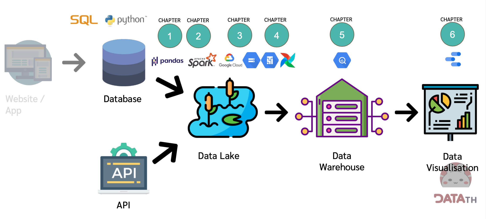
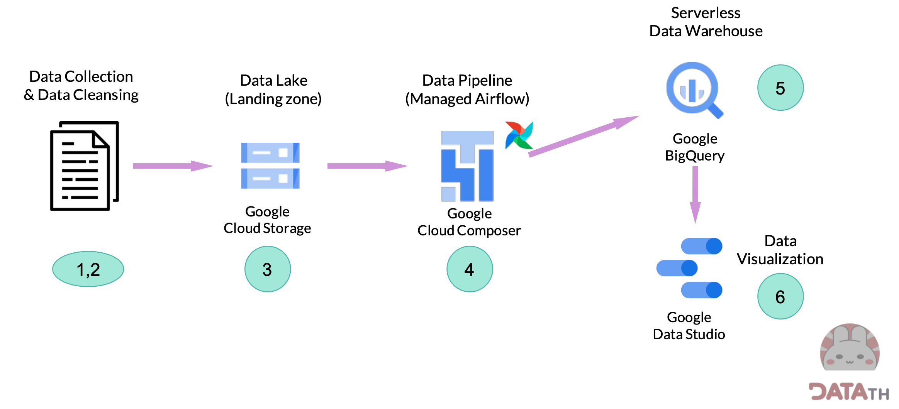
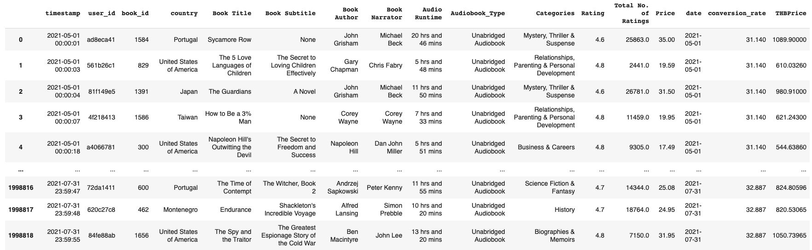
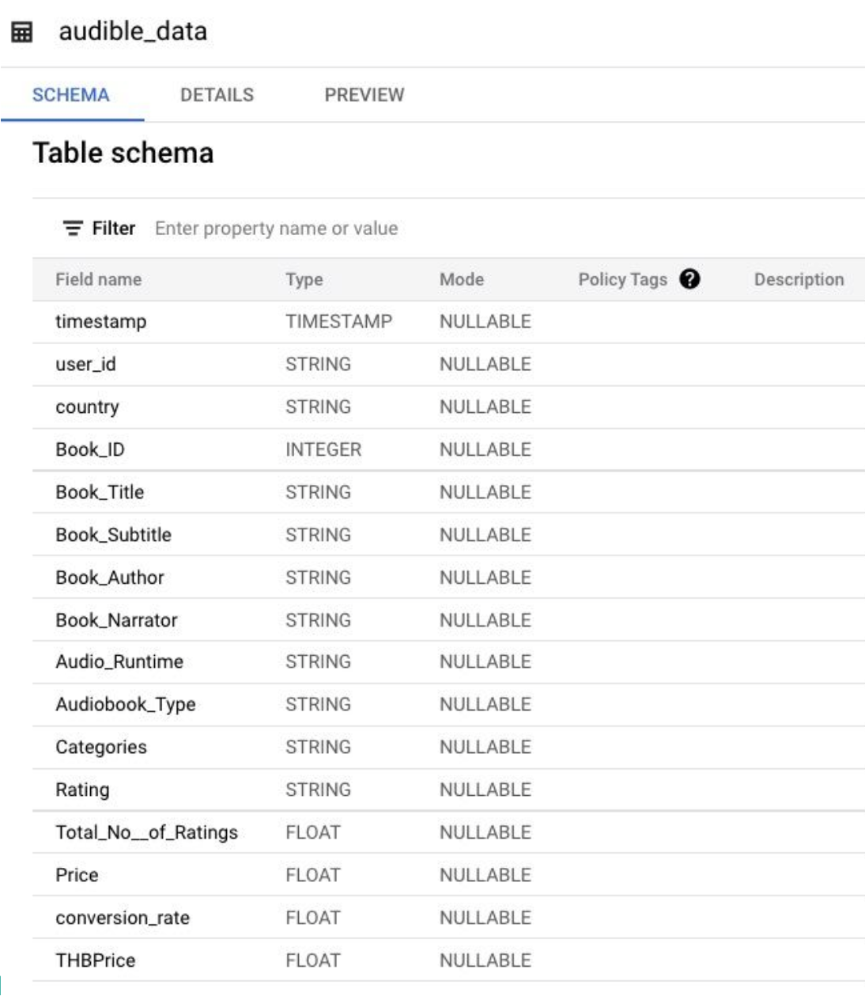
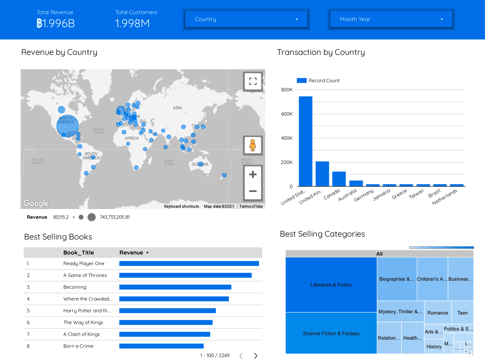
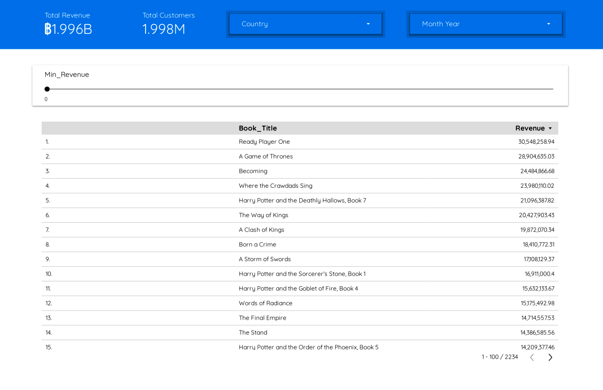
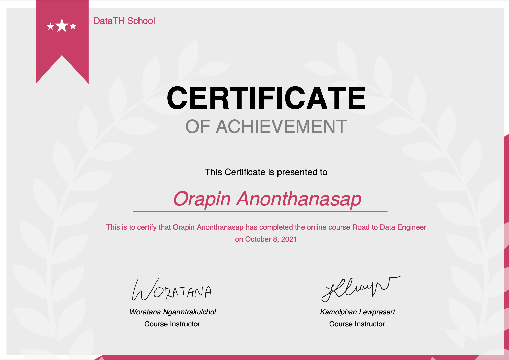

<h1 align="center" id="Data Engineer Project">Data Engineer Project</h1> 
<h3 id="(Data as of 7/7/2021)"><i>(Data as of 10 October 2021)</i></h3>
<li>
<a href="https://datastudio.google.com/reporting/77caf52a-121c-4728-8edd-47453f22a1b3">LINK to my Google Data Studio Dashboard</a>
</li>
 

Last two months, I had an excellent opportunity to take the Road to Data Engineer (R2DE 2.0) course from DATAth.com.
Road to Data Engineer (R2DE) is a course that provides fundamental to advance knowledge in the Data Engineer track with the workshop in every chapter. We can apply the knowledge to build our end-to-end Data Pipeline by using the cutting edge technology that is popular today

This dashboard was inspired by <a href="https://school.datath.com/courses/road-to-data-engineer-2">Road to Data Engineer</a> course :) 

<h2 id="Tech Stack">Tech Stack</h2>
✔️ Python (Google Colab) 
✔️ SQL 
✔️ Pandas 
✔️ Apache Spark, PySpark 
✔️ Apache Airflow, DAG: Directed Acyclic Graph 
✔️ Google Cloud Platform (GCP) 
✔️ Google BigQuery 
✔️ Google Data Studio  
✔️ Databricks 
✔️ Basic and Advanced Git + CI/CD 
✔️ Docker + Airflow + Kubernetes 

 
<h2 id="Course Curriculum">Course Curriculum</h2>

Data Engineer end-to-end flow

✔️ CH0 Introduction to Data Engineering - Python & SQL

- Basic of Data Engineer
- Concept of Big Data & Hadoop
- Database, Data Warehouse, Data Lake 

✔️ CH1 Data Pipeline & ETL
- Data Pipeline (ETL/ELT)
- Data Pipeline designing
- Data Integration
- Workshop 1: Data Collection with Python (Google Colab), Pandas, REST API

✔️ CH2 Data Quality & Wrangling
- Data Cleansing
- Data Quality (Data Lineage and Data Dictionary)
- EDA (Exploratory Data Analysis) and Data Profiling 
- Handling Anomaly และ missing data 
- Distributed Data Processing 
- Concept of Apache Spark 
- Workshop 2: Data Wrangling, Data Cleansing with Apache Spark (Colab and PySpark)

✔️ CH3 Basic Cloud - Google Cloud
- Cloud Computing concept with Google Cloud Platform (GCP)
- Concept of public / private / hybrid cloud
- Cloud vs on-premise
- Concept of Cloud computing e.g., Managed Service and serverless
- GCP (Google Cloud Platform) services
- Data Processing and storage on cloud 
- Basic of Bash Command
- Workshop 3: Data Storage with GCS

✔️CH4 Data Pipeline Orchestration with Airflow
- Data Pipeline Orchestration
- Data Pipeline tool
- Concept of Apache Airflow
- DAG: Directed Acyclic Graph
- Cloud Composer (GCP)
- Create data pipeline with Apache Airflow 
- Workshop 4: Automated Data Pipeline with Airflow

✔️ CH5 Introduction to BigQuery
- Data Warehouse
- BigQuery and the concept of BigQuery 
- Load data into BigQuery
- Design schema in BigQuery
- Workshop 5: Building Data Warehouse with BigQuery (feeding data from AirFlow)

✔️ CH6 Introduction to Google Data Studio
- Data visualization
- Google Data Studio
- Connect Data Studio with data sources
- Dimension and Metric in chart 
- Workshop 6: Building dashboard with Google Data Studio (Data from BigQuery)

✔️ CH7 Advanced Data Engineering
- Case study for using data pipeline
- Data Architecture
- Git and Docker container
- Data Privacy 
- Introduce to Machine Learning engineer 
- ML deployment pipeline (MLDevOp)
- The future of Data Warehouse e.g., Snowflake

✔️ Special Classes
- Intro to Databricks
- What I have learned working with data
- Enterprise Data Architecture
- Slowly Changing Dimension
- What recruiter looks for in DE LinkedIn Profile
- Intro to PowerBI
- Soft skills for Data Engineers
- Intro to Data Monitoring
- Basic and Advanced Git + CI/CD
- Docker + Airflow + Kubernetes

<h2 id="The workshop">The Data Engineer workshop</h2>

Data Engineer end-to-end flow

- Workshop 1: Data Collection with Python (Google Colab), Pandas, REST API
- Workshop 2: Data Wrangling, Data Cleansing with Apache Spark (Colab and PySpark)

Example of our dataset (Audible book data)

- Workshop 3: Data Storage with Google Cloud Storage
- Workshop 4: Automated Data Pipeline with Airflow
- Workshop 5: Building Data Warehouse with BigQuery (feeding data from AirFlow)
- Workshop 6: Building dashboard with Google Data Studio (Data from BigQuery)

<h2 id="Workshop 6: Data Visualisation with Google Data Studio (Data from BigQuery)">Workshop 6: Building dashboard with Google Data Studio (Data from BigQuery)</h2>

Dashboard is the last step of the Data Engineer/Data Science work.
This article will show the last workshop building dashboard with Google Data Studio 

Google Data Studio:
Data Studio is a free tool that turns your data into informative, easy to read, easy to share, and fully customizable dashboards and reports.

Input: Data store in BigQuery -> Output: Report and Dashboard on Google Data Studio

Example of our dataset (Audible book data)

 
<h3 id="Step to do Dashboard:">Step to do Dashboard:</h3>

1. Create table in BigQuery 
2. Creating view, filtering some data for dashboard  
<i>CREATE VIEW vw_customer_purchase AS 
SELECT customer AS customer_name, COUNT(*) AS purchase_count 
FROM sales_table 
GROUP BY customer_name;  </i>

Create a View to let DataAnalyst see only information to use 
- Income (Thai Baht) 
- Country 
- Name book 
- Customer ID (take into account Total Customer) 
- Book category 
- Time to buy 
- Book ID (for future use) 

3. Create Dashboard

  

<a href="https://datastudio.google.com/reporting/77caf52a-121c-4728-8edd-47453f22a1b3">LINK to my Google Data Studio Dashboard</a>
<h3 id="The 1st Dashboard contains:">The Dashboard 1 "Overview" contains:</h3>

Show summary: 
- Business income 
- Number of customers 
- Number of purchases in each country 
- Bestsellers 
- Best selling book category. </li>

  

 

Dashboard 1: Overview

<h3 id="The 1st Dashboard contains:">The Dashboard 2 "Search book by revenue" contains:</h3>

System for searching books by sales: 
- can select country select sales at want to search 
- Displays only books that meet the Search Criteria. </li>
 

Dashboard 2: Search book by revenue

<i>Notes: The parameter allows the user to enter their information.
We can create a variable (Parameter) to allow users to fill in their data or choose.
Parameters can be used in the Calculated Field.
 

Notes2: Calculated Field, write your equations
If an existing column doesn't meet our needs, we can write an equation from the existing data to create the column we need.
</i>
 

 

<h2 id="Certificate after graduation">Certificate after graduation</h2>
After completing the course and passing the final exam, you will immediately receive a certificate from the Road to Data Engineer instructor!
  

Certificate after graduation

<h2 id="References Data">References Data</h2>
<ol>

<li>
<a href="https://school.datath.com/courses/road-to-data-engineer-2">Road to Data Engineer course by DataTH</a>
</li>

<li>
<a href="https://datastudio.google.com/u/0/reporting/77caf52a-121c-4728-8edd-47453f22a1b3/page/qRFbC">LINK to my Google Data Studio Dashboard</a>
</li>

